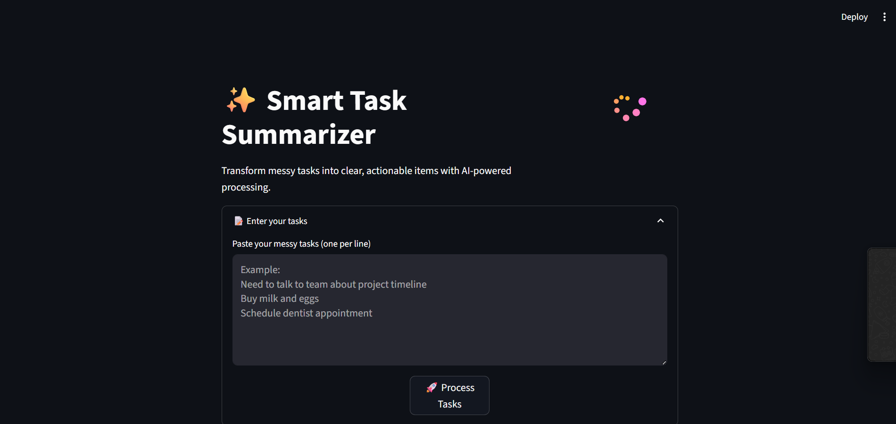
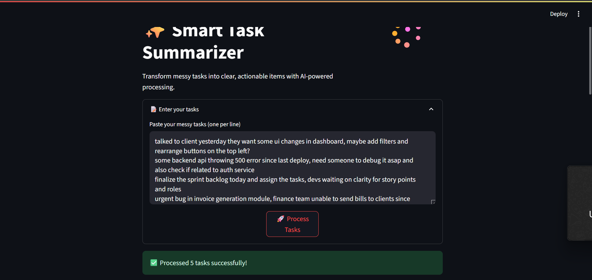
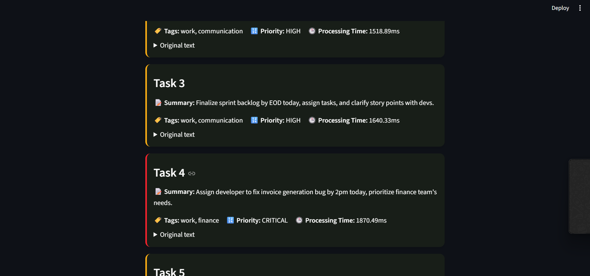
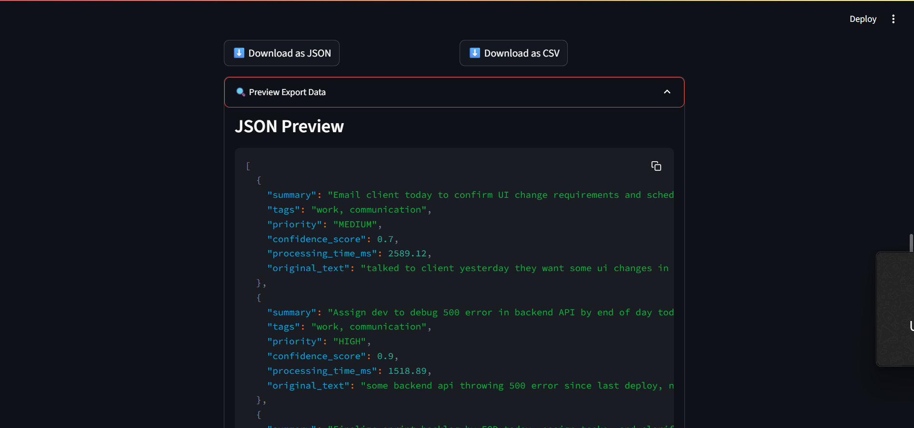
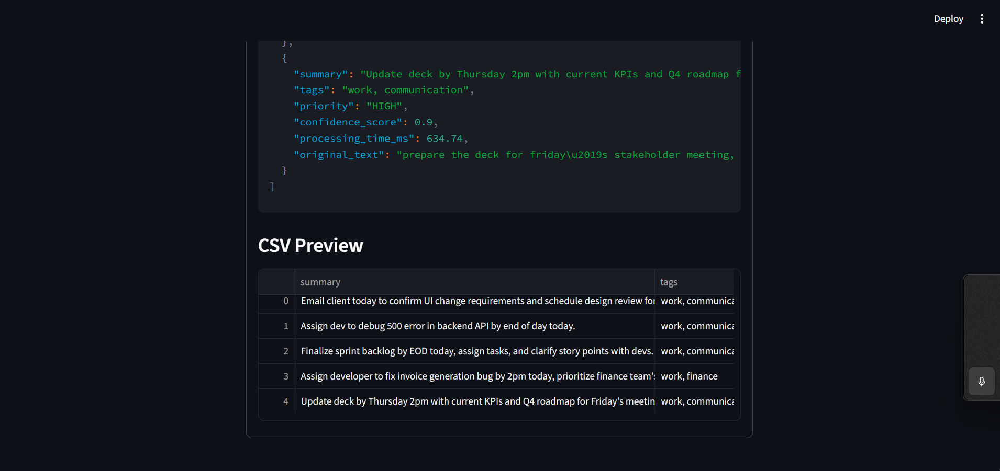

# 📌 Smart Task Summarizer + Tagger

[](https://opensource.org/licenses/MIT)
[](https://www.python.org/)
[](https://streamlit.io/)
[](https://www.langchain.com/)

An AI-powered productivity tool that helps project managers and professionals clean up messy task descriptions. Paste in raw notes from meetings or calls — and the tool generates actionable summaries, applies relevant tags, assigns priority levels, and visualizes the results beautifully.

---

## ✨ Key Features

- *AI-Powered Task Processing*
  - Converts unstructured task notes into concise, actionable summaries
  - Automatically classifies tasks with up to 3 relevant tags
  - Assigns priority levels (`low`, `medium`, `high`, `critical`) with confidence scores

- *Interactive Web Interface*
  - Built using Streamlit with modern animations and dark theme
  - Real-time task processing with loading indicators and result cards
  - Tabs to view task list and analytics

- *Task Analytics Dashboard*
  - Priority distribution with metrics
  - Tag frequency visualized as a responsive word cloud
  - Average processing time displayed


---

## 🛠 Technology Stack

- **Frontend**: Streamlit (Web UI)
- **Backend / Logic**:
  - LangChain + Groq (LLaMA3-70B-8192)
  - Python 3.10+
  - Pydantic (Schema definitions)
- **Visualization**: Streamlit custom CSS + Metrics + Lottie animations
- **Utilities**: `dotenv`, `rich`, `time`, `json`, `logging`

---

## 📦 Installation & Setup

1. **Clone the repository**
```bash
git clone https://github.com/Sabari2005/Smart-Task-Summarizer-Tagger.git
cd Smart-Task-Summarizer-Tagger
```
2. **Install the prerequirements**
```bash
pip install -r requirements.txt
```
3. **Replace with you GROQ API key in env**
```bash
GROQ_API_KEY="YOUR-API-KEY"
```
4. **Run the main file**
```bash
streamlit run main.py
```

## Folder Structure

```bash
.
├── main.py               # Streamlit main application
├── schema.py            # Pydantic models for input/output
├── requirements.txt     # Python dependencies
├── .env       # Template for environment variables
├── animation.json       # Lottie animation for UI
├── assets/         # UI screenshots
└── README.md            # This documentation
```

## 📋 Supported Tags

The system intelligently applies up to **3 tags per task** to help organize and prioritize work effectively.

### Available Tags:

- 🛠 `#backend` – Tasks related to backend development, APIs, and databases.
- 🎨 `#frontend` – UI/UX tasks, styling, and client-side logic.
- 📞 `#client` – Tasks involving client interaction or requirements.
- ⏰ `#urgent` – High-priority tasks that need immediate attention.
- ✅ `#completed` – Tasks that are finished and verified.
- 🧠 `#ai` – AI/ML model development, training, or integration tasks.
- 💬 `#discussion` – Tasks or issues needing team input or debate.
- 🔍 `#review` – Code or feature review tasks.
- 💼 `#meeting` – Tasks referring to scheduled meetings or summaries.
- ✏️ `#documentation` – Writing or editing technical documentation.
- 📦 `#deployment` – Deployment-related tasks or configurations.
- 🧹 `#cleanup` – Refactoring, removing unused code, or cleaning up assets.


## 🖼 Screenshots
<div align="center"> 
 
 
 
 
 

</div>

## ▶ Video Demonstration

[Watch the demo video](https://www.youtube.com/watch?v=dQw4w9WgXcQ)

## 👤 Author

### Sabari Vadivelan S

- 📧 Email: [sabari132005@gmail.com](sabari132005@gmail.com)

- 🔗 GitHub: [https://github.com/sabari2005](https://github.com/sabari2005)
